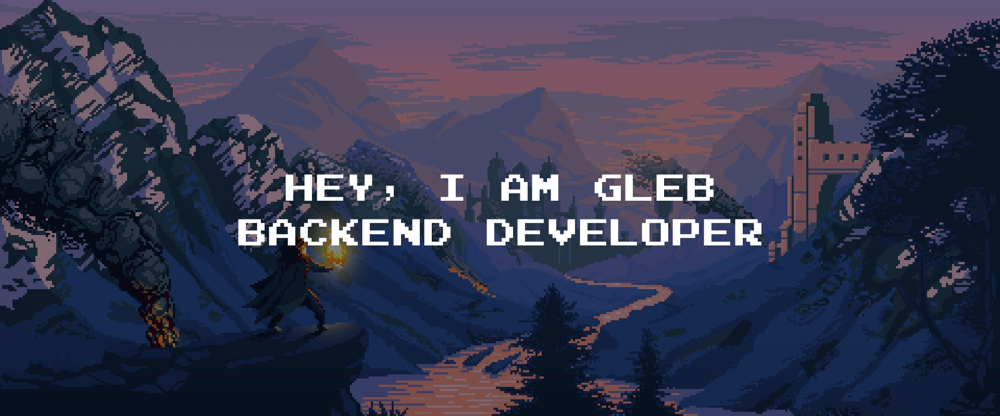

  
  
  
  
  
  

- 🔭 &nbsp;I’m currently working on something cool :wink:
- 🌱 &nbsp;I’m currently learning Go, Python
- 💬 &nbsp;Ask me about anything related to Javascript/Typescript/Python
- 👨‍💻 &nbsp;Read more about my projects at [motovilovgleb.com](https://www.motovilovgleb.com/#portfolio)
- 💻 &nbsp; Connect with me on [LinkedIn](https://www.motovilovgleb.com/#portfolio)
- ⚡ &nbsp;Fun fact: I :heart: :dog:s

 

<table>
  <tr>
    <td align="center" width="96">
      
       Go
    </td>
    <td align="center" width="96">
      
       Python
    </td>
    <td align="center" width="96">
      
       Jsonnet
    </td>
    <td align="center" width="96">
      
       TypeScript
    </td>
    <td align="center" width="96">
      
       Kubernetes
    </td>
    <td align="center" width="96"> 
      
       Docker
    </td>
    <td align="center"  width="96">
      
       Debian
    </td>
    <td align="center" width="96">
      
       Grafana
    </td>
  </tr>
</table>
